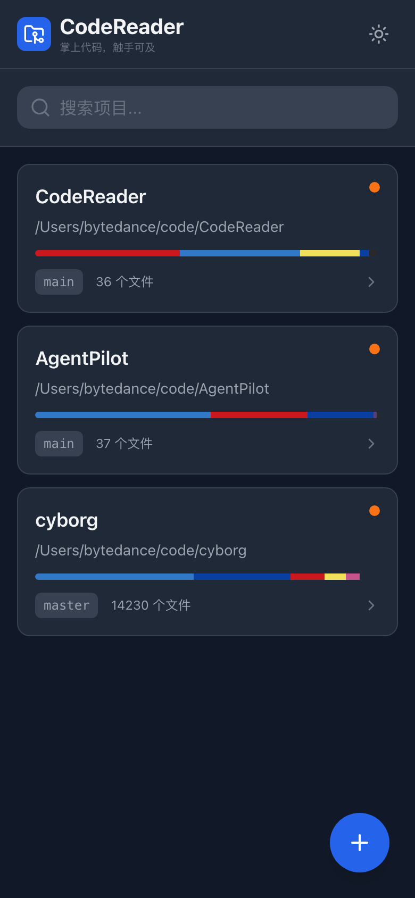
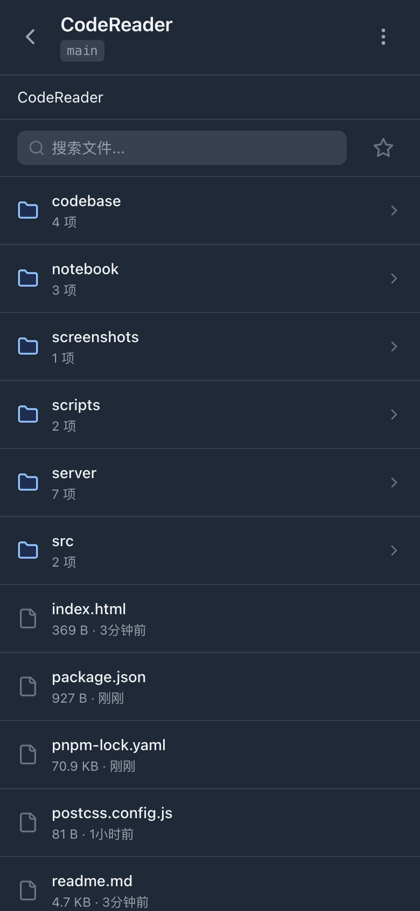
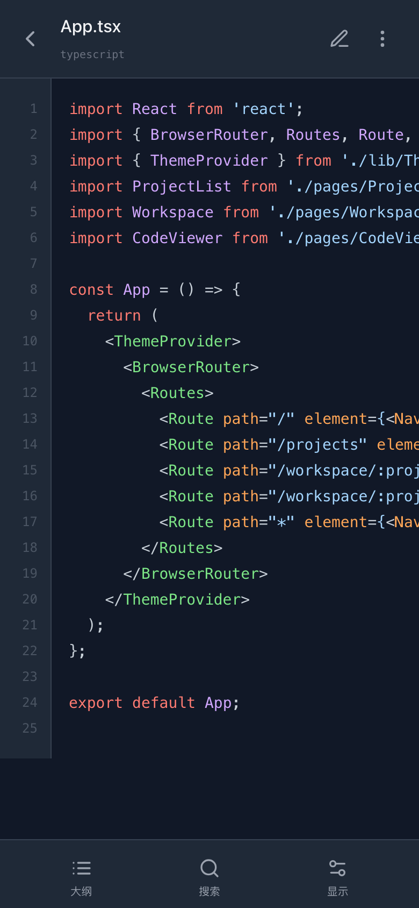
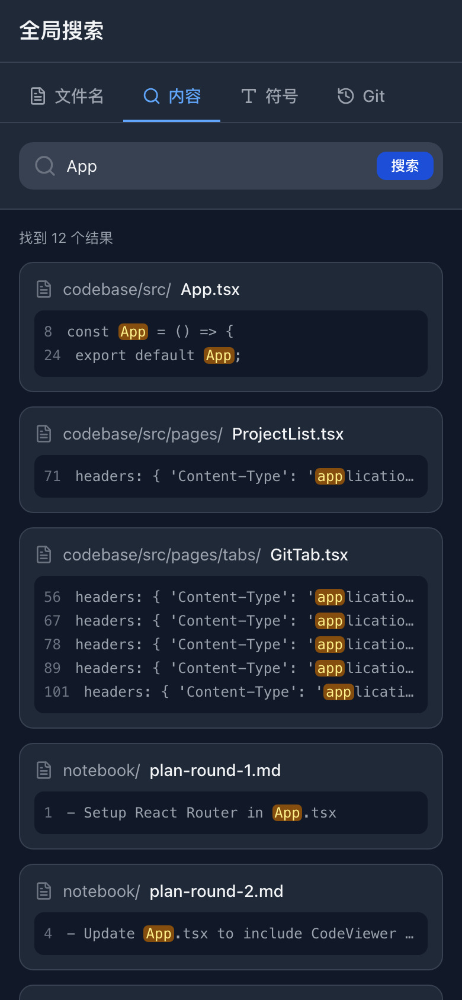
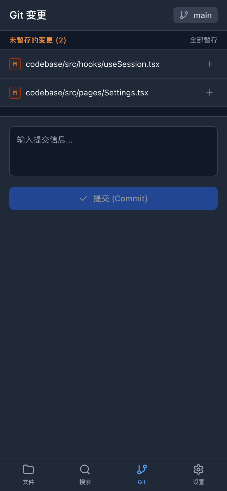
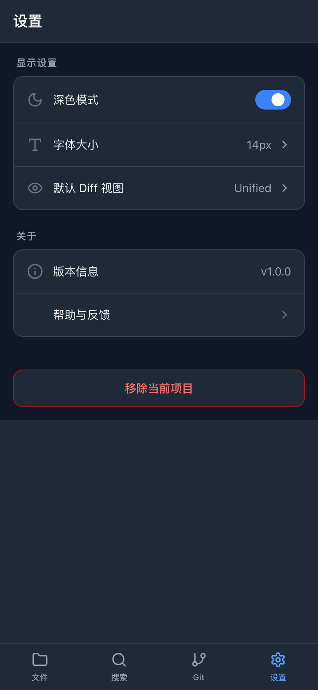

# CodeReader

把本地代码仓库变成适合手机、平板阅读和轻量 Review 的 Web 应用。

CodeReader 适合在电脑或内网机器上启动服务，然后用手机扫码访问本地仓库。你可以浏览项目文件、搜索代码、查看 Git diff，并在确认后暂存和提交变更。代码不需要上传到第三方平台。

## 典型场景

### 手机上看代码改动

在 `Git` 页面查看当前分支、未暂存/已暂存文件和 diff。适合通勤、会议间隙或离开工位时快速判断改动是否合理。

### 快速熟悉一个项目

在 `文件` 页面按目录浏览仓库，打开文件后可以看语法高亮、行号、图片预览，也可以调整字体大小。

### 临时定位代码

在 `搜索` 页面按文件名、代码内容、符号或提交记录查找，搜索结果可以直接跳到对应文件。

### 轻量提交变更

看完 diff 后，可以逐个暂存文件、取消暂存、填写 commit message 并提交。配置 AI 后，也可以根据 diff 生成提交信息草稿。

### 给别人临时展示本地项目

同一个局域网内，把二维码或访问地址发给对方，对方不用安装 IDE 就能浏览项目结构和关键文件。

## 截图

<table>
  <tr>
    <td align="center">项目列表</td>
    <td align="center">文件浏览</td>
    <td align="center">代码查看</td>
  </tr>
  <tr>
    <td></td>
    <td></td>
    <td></td>
  </tr>
  <tr>
    <td align="center">全局搜索</td>
    <td align="center">Git 变更</td>
    <td align="center">设置</td>
  </tr>
  <tr>
    <td></td>
    <td></td>
    <td></td>
  </tr>
</table>

## 启动

需要先安装 Node.js 18+ 和 pnpm。

```bash
pnpm install
pnpm dev:all
```

启动后终端会打印本机地址、局域网地址和二维码：

- 电脑访问：`http://localhost:5102`
- 手机访问：让手机和电脑连同一个局域网，然后扫描终端二维码
- 前端端口：`5102`
- 后端 API 端口：`3102`

如果想分别启动前后端：

```bash
pnpm dev:server
pnpm dev
```

生产模式：

```bash
pnpm build
pnpm start
```

生产模式默认访问 `http://localhost:3102`。如需改端口：

```bash
PORT=8080 pnpm start
```

## 添加项目

进入应用后点击右下角 `+`，选择本地仓库目录即可。项目配置会保存到 `server/config.json`。

也可以手动编辑：

```json
{
  "projects": [
    { "name": "MyProject", "path": "/path/to/my-project" }
  ]
}
```

## AI Commit

AI Commit 是可选功能。不配置时，阅读、搜索、Git diff、暂存和提交都可以正常使用。

如需启用，在项目根目录创建 `.env`：

```bash
AI_API_KEY=sk-xxxxx
AI_BASE_URL=https://api.openai.com/v1
AI_MODEL=gpt-4o-mini
```

## 安全提示

CodeReader 会读取本地文件系统，并提供 Git 暂存、取消暂存和提交能力。建议只在可信局域网、VPN 或 SSH 隧道中使用，不要直接暴露到公网。
